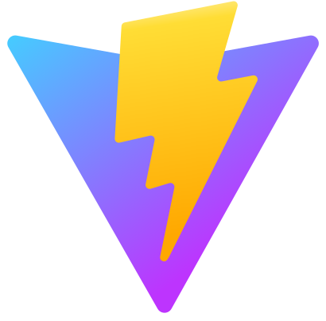

# DT Money 💸

<p align="center">
  <a href="https://vitejs.dev"></a>
</p>

<p align="center">
  <a href="#-layout">Layout</a> •
  <a href="#-technologies">Technologies</a> •
  <a href="#-getting-started">Getting started</a> •
  <a href="#-license">License</a>
</p>

<p align="center">
  
</p>

## 🔖 Layout

The author of this layout is [Millena Kupsinsku Martins](https://www.figma.com/@millenakmartins). You can view the project in this [link](https://www.figma.com/community/file/1138814493269096792).

## 🚀 Technologies and Concepts

- [ReactJS](https://reactjs.org/)
- [Vite](https://vitejs.dev)
- [TypeScript](https://www.typescriptlang.org/)
- [Styled components](https://styled-components.com/)
- [Radix UI](https://www.radix-ui.com/)
- [JSON Server](https://github.com/typicode/json-server)
- [React Hook Form](https://react-hook-form.com/)
- [Use Context Selector](https://github.com/dai-shi/use-context-selector)
- [useCallback, memo, useMemo](https://pt-br.reactjs.org/)

## 💻 Getting started

### Requirements

- [Node.js](https://nodejs.org/en/)
- [Yarn](https://classic.yarnpkg.com/) or [npm](https://www.npmjs.com/package/npm)

**Clone the project and access the folder**

```bash
git clone https://github.com/luancardosoti/ignite22-dt-money.git && cd ignite22-dt-money
```

**Follow the steps below**

```bash
# Install the dependencies
$ npm i
# Run JSON Server
$ npm run dev:server
# Run project
$ npm run dev
```

## 📝 License

This project is licensed under the MIT License - see the [LICENSE](LICENSE) file for details.

---

<p align="center">
  Made
